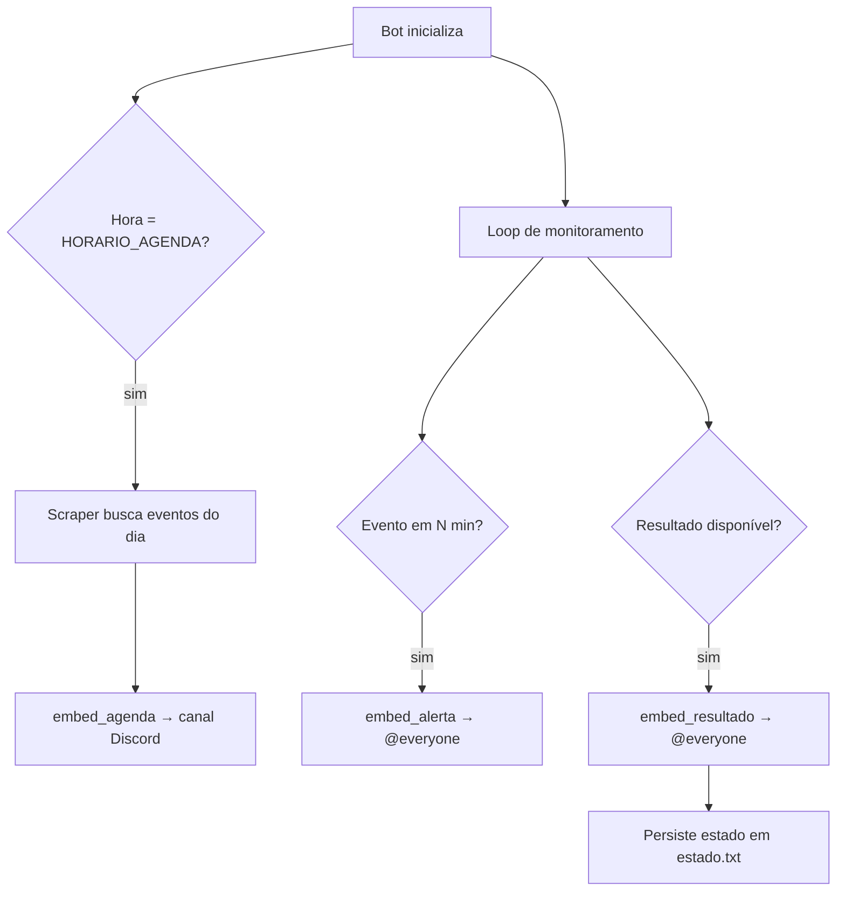

# EcoBot — Discord Economic Calendar Bot


Bot para Discord que monitora o [ForexFactory](https://www.forexfactory.com/calendar) em tempo real e entrega automaticamente — sem intervenção manual — a agenda econômica diária, alertas pré-evento e resultados com análise de surpresa diretamente num canal do servidor.

---

## O problema

Traders de cripto e forex precisam acompanhar o calendário econômico para antecipar janelas de alta volatilidade (NFP, CPI, FOMC, etc.). Acessar o site manualmente durante o pregão é lento e sujeito a esquecimento. O EcoBot automatiza essa vigilância e leva a informação para onde o trader já está: o Discord.

---

## Demo

> **Agenda diária (07h BRT)**


> **Alerta pré-evento (15 min antes)**


> **Resultado com análise de surpresa**


---

## Funcionalidades

- Posta a agenda econômica filtrada todo dia às 07h (horário configurável)
- Alerta `@everyone` X minutos antes de eventos de alto impacto (configurável)
- Posta o resultado assim que disponível no ForexFactory, com cálculo de surpresa (real vs. previsão), incluindo valores com sufixos K/M/B/T
- Filtro de moeda (ex.: apenas `USD`) e filtro de impacto mínimo (`alto`, `medio`, `baixo`)
- Retry automático no scraping: 5 tentativas com espera de 30 s entre elas
- Timezone configurável via variável de ambiente — suporta servidores no Brasil e nos EUA sem alterar código
- Reinício automático via `restart: always` no Docker

---

## Stack e arquitetura

| Camada | Tecnologia |
|---|---|
| Bot framework | discord.py 2.7 |
| Scraping | BeautifulSoup4 + lxml + requests |
| Timezone | zoneinfo (stdlib) + tzdata |
| Config | python-dotenv |
| Deploy | Docker + docker-compose |
| Infraestrutura | Oracle Cloud Free Tier (Ubuntu 22.04) |
| Runtime | Python 3.13 |



---

## Decisões técnicas e trade-offs

**Por que scraping e não API oficial?**
O ForexFactory não oferece API pública. O scraper usa BeautifulSoup + lxml para parsear o HTML do calendário. O ponto fraco é fragilidade a mudanças no HTML — aceitável para um MVP com monitoramento ativo.

**Por que `zoneinfo` em vez de `pytz`?**
`pytz` foi descontinuado como dependência principal a partir do Python 3.9. `zoneinfo` é parte da stdlib no Python 3.9+ e o pacote `tzdata` garante os dados de timezone no ambiente Docker sem dependências de sistema.

**Por que timezone configurável via `.env` (`FOREX_TZ`)?**
O ForexFactory detecta o IP do servidor e serve os horários no fuso local correspondente. Um servidor no Brasil recebe horários em BRT; um servidor nos EUA recebe em ET. Hardcodear o fuso causaria horários errados dependendo do ambiente de deploy. A variável `FOREX_TZ` resolve isso sem alterar código.

**Por que persistência em arquivo (`estado.txt`) em vez de banco de dados?**
O bot precisa apenas rastrear quais eventos já tiveram alerta e resultado enviados para evitar duplicatas entre reinícios. Um arquivo JSON simples atende esse requisito sem adicionar a complexidade de um banco de dados. Volume Docker garante que o arquivo sobrevive a reinícios do container.

**Por que Oracle Cloud Free Tier?**
A VM `VM.Standard.E2.1.Micro` (1 OCPU, 1 GB RAM) é permanentemente gratuita no Oracle Always Free — sem expiração, sem custo. Docker com `restart: always` garante disponibilidade contínua sem supervisão.

---

## Como rodar localmente

### Pré-requisitos

- Python 3.11+ **ou** Docker
- Bot criado no [Discord Developer Portal](https://discord.com/developers/applications) com permissões `Send Messages`, `Embed Links` e `Mention Everyone`
- **Message Content Intent** ativado no painel do bot
- ID do canal onde as mensagens serão postadas

### Com Docker (recomendado)

```bash
git clone https://github.com/[SEU_USUARIO]/discord-eco-bot.git
cd discord-eco-bot

# Crie os arquivos de runtime antes de subir o container
touch bot.log estado.txt

cp .env.example .env
# edite o .env com seu token e canal

docker-compose up -d --build
docker-compose logs -f
```

### Sem Docker

```bash
python3 -m venv venv
source venv/bin/activate  # Windows: venv\Scripts\activate

pip install -r requirements.txt

cp .env.example .env
# edite o .env

python bot.py
```

### Variáveis de ambiente

```env
# Obrigatório
DISCORD_TOKEN=seu_token_aqui
CANAL_ID=id_do_canal_aqui

# Horário de postagem da agenda (fuso BRT)
HORARIO_AGENDA=07:00

# Minutos antes do evento para disparar o alerta
MINUTOS_ALERTA=15

# Impacto mínimo para agenda (alto / medio / baixo)
IMPACTO_MINIMO_AGENDA=baixo

# Impacto mínimo para alertas e resultados
IMPACTO_MINIMO_ALERTA=alto

# Filtro de moedas — vazio = todas as moedas
MOEDAS_FILTRO=USD

# Fuso do ForexFactory conforme IP do servidor
# America/Sao_Paulo → servidor no Brasil
# America/New_York  → servidor nos EUA
FOREX_TZ=America/Sao_Paulo
```

---

## Testes

> Cobertura de testes unitários não implementada neste MVP. Ver roadmap.

---

## Estrutura de pastas

```
discord-eco-bot/
├── bot.py              # Ponto de entrada: cliente Discord, jobs, embeds
├── scraper.py          # ForexFactoryScraper: HTTP com retry + parsing HTML
├── config.py           # Leitura e validação das variáveis de ambiente
├── requirements.txt
├── Dockerfile
├── docker-compose.yml
├── .env.example        # Template de configuração (não contém segredos)
├── estado.txt          # Persistência de estado entre reinícios (gerado em runtime)
└── bot.log             # Log em arquivo (gerado em runtime)
```

---

## Roadmap

- [ ] Testes unitários para o scraper e para o parser de valores
- [ ] Suporte a múltiplos canais (agenda em um, alertas em outro)
- [ ] Comando slash `/agenda` para consulta manual
- [ ] CI/CD com GitHub Actions (lint + testes)
- [ ] Análise de impacto histórico (real vs. previsão ao longo do tempo)

---

## O que aprendi com o projeto

**Scraping em produção é diferente de scraping em dev.** O ForexFactory detecta o IP e altera o fuso dos horários servidos, o que causou bugs sutis só descobertos ao fazer o deploy na nuvem. A solução (tornar o fuso configurável) exigiu entender o comportamento do site, não apenas debugar o código.

**Gerenciar estado mínimo é mais difícil do que parece.** Garantir que alertas e resultados não sejam reenviados após um reinício do container, sem usar banco de dados, exigiu pensar cuidadosamente no ciclo de vida do processo e na atomicidade das escritas em arquivo.

**Compatibilidade de dependências importa.** `discord.py 2.4.0` usa `audioop`, que foi removido do Python 3.13. Aprendi a não pinar versões de libs sem verificar compatibilidade com a versão do runtime, e a preferir pins sem versão menor quando o projeto não tem testes automatizados cobrindo essa fronteira.

**Docker em VMs de baixo recurso tem restrições reais.** Com 1 GB de RAM, o build precisa ser enxuto — evitar imagens base desnecessariamente grandes e não compilar extensões C quando há wheels pré-compiladas disponíveis (caso do `lxml` com `manylinux`).

---

## Como atualizar em produção

O bot roda em um servidor VPS (Oracle Cloud) via Docker. Para aplicar alterações:

**1. Edite os arquivos localmente**

**2. Envie os arquivos alterados para o servidor via SCP**

```bash
# Exemplo: atualizar bot.py e scraper.py
scp -i "ssh-key-2026-06-17.key" bot.py scraper.py ubuntu@<IP_DO_SERVIDOR>:~/discord-eco-bot/
```

**3. Conecte ao servidor via SSH**

```bash
ssh -i "ssh-key-2026-06-17.key" ubuntu@<IP_DO_SERVIDOR>
```

**4. Reconstrua e reinicie o container**

```bash
cd ~/discord-eco-bot
sudo docker-compose up -d --build
```

**5. Verifique os logs**

```bash
sudo docker-compose logs -f
```

O container anterior é substituído automaticamente, com downtime de poucos segundos.

---

## Contato

**Artur Matoso Nery**
- LinkedIn: [linkedin.com/in/artur-matoso-nery-84a4971a9](https://www.linkedin.com/in/artur-matoso-nery-84a4971a9/)
- GitHub: [github.com/arturnery](https://github.com/arturnery?tab=repositories)
- Email: arturnery1997@gmail.com
- Portfólio: em construção
